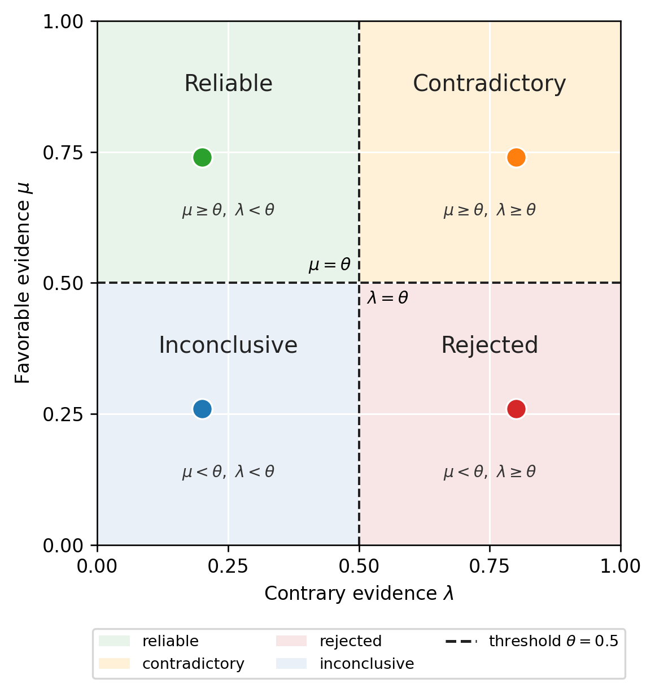

<p align="center">
  
</p>

<h1 align="center">PEAS — Paraconsistent Explanation Audit System</h1>

<p align="center">
  <a href="https://github.com/sbarbonjr/peas/blob/main/LICENSE"></a>
  
  
</p>

---

> **Validating explanations produced by machine learning models is inherently multi-dimensional: faithfulness and stability often provide conflicting signals that scalar aggregation hides rather than resolves.**

PEAS is an audit framework that maps XAI validation evidence into a [Paraconsistent Annotated Logic with two values (PAL2v)](https://doi.org/10.1007/3-540-15984-3_270) representation. Instead of collapsing conflicting signals into a single trust score, PEAS assigns each explanation to one of **four diagnostic states** — *reliable*, *contradictory*, *rejected*, or *inconclusive* — while preserving the contradiction as a meaningful signal.

<p align="center">
  
</p>

---

## Why PEAS?

A standard trust score $s = (\mu + 1 - \lambda)/2$ is an affine transform of the certainty $c = \mu - \lambda$. It depends only on the **difference** between favorable and contrary evidence, and is therefore **blind to their individual magnitudes**. Two explanations with $(\mu=0.9, \lambda=0.8)$ and $(\mu=0.5, \lambda=0.4)$ receive the same score — yet the first is *contradictory* (high-performing but unstable) while the second is *inconclusive*. PEAS resolves this ambiguity.

| Configuration | $\mu$ | $\lambda$ | $s$ (single score) | PEAS state |
|---|---|---|---|---|
| Faithful + stable | 0.71 | 0.29 | 0.71 | **Reliable** |
| Faithful + unstable | 0.91 | 0.49 | **0.71** | **Contradictory** |

The two configurations have identical single scores, yet only PEAS flags the second one for inspection.

---

## Installation

```bash
pip install peas-xai
```

With plotting support:

```bash
pip install "peas-xai[plot]"
```

From source:

```bash
git clone https://github.com/sbarbonjr/peas.git
cd peas
pip install -e ".[all]"
```

---

## Quickstart

### Audit from pre-computed scores

```python
from peas import PEASScorer
from peas.evidence import FaithfulnessEvidence, StabilityEvidence

scorer = PEASScorer(
    mu_source=FaithfulnessEvidence(),
    lambda_source=StabilityEvidence(),
)

# If you already have mu and lambda values:
result = scorer.audit_precomputed(mu=0.847, lam=0.193)
print(result)
# [RELIABLE] mu=0.847  lambda=0.193  certainty=+0.654  contradiction=-0.040
```

### Full audit from a trained model and ranking

```python
import pandas as pd
from sklearn.ensemble import RandomForestClassifier
from peas import PEASScorer
from peas.evidence import FaithfulnessEvidence, StabilityEvidence

# Your trained model and data
model = RandomForestClassifier().fit(X_train, y_train)

# Feature ranking from any XAI method (must have 'feature' and 'rank' columns)
ranking = pd.DataFrame({
    "feature": ["age", "income", "credit_score"],
    "rank":    [1, 2, 3],
    "importance_score": [0.45, 0.31, 0.24],
})

scorer = PEASScorer(
    mu_source=FaithfulnessEvidence(random_repetitions=20),
    lambda_source=StabilityEvidence(),
    k=5,
)

result = scorer.audit(model, X_train, X_eval, y_eval, ranking, k=3)
print(result)
```

### Custom threshold policies

```python
from peas import PEASScorer
from peas.evidence import FaithfulnessEvidence, StabilityEvidence
from peas.logic import AsymmetricThreshold, CalibratedThreshold

# Asymmetric: require higher faithfulness, tolerate more instability
scorer = PEASScorer(
    mu_source=FaithfulnessEvidence(),
    lambda_source=StabilityEvidence(),
    threshold=AsymmetricThreshold(theta_mu=0.65, theta_lam=0.40),
)

# Calibrated: set theta to the median of observed scores
threshold = CalibratedThreshold()
threshold.fit(mus=[0.84, 0.87, 0.77, 0.81], lams=[0.19, 0.21, 0.35, 0.25])
scorer = PEASScorer(
    mu_source=FaithfulnessEvidence(),
    lambda_source=StabilityEvidence(),
    threshold=threshold,
)
```

### Visualise the diagnostic plane

```python
from peas.utils.plot import plot_diagnostic_plane

results = [
    {"method": "KernelSHAP",  "mu": 0.872, "lam": 0.196, "diagnostic": "reliable"},
    {"method": "LIME",        "mu": 0.866, "lam": 0.196, "diagnostic": "reliable"},
    {"method": "DPG",         "mu": 0.871, "lam": 0.358, "diagnostic": "reliable"},
    {"method": "random",      "mu": 0.494, "lam": 0.546, "diagnostic": "rejected"},
]

ax = plot_diagnostic_plane(results, theta=0.5, label_key="method")
ax.figure.savefig("diagnostic_plane.png", dpi=150)
```

---

## Extending PEAS

### Custom evidence source

Any measurable explanation property normalised to [0, 1] can serve as $\mu$ or $\lambda$:

```python
from peas.evidence import EvidenceSource
import pandas as pd

class CompactnessEvidence(EvidenceSource):
    """Favorable evidence from explanation sparsity (fewer features = more compact)."""

    def __init__(self, max_features: int = 20):
        super().__init__(name="compactness")
        self.max_features = max_features

    def score(self, model, X_train, X_eval, y_eval, ranking, k, seed=0):
        # Fraction of features NOT needed to explain the prediction
        n_features = len(ranking)
        return self._clip(1.0 - k / min(n_features, self.max_features))

# Use it as mu alongside stability as lambda
from peas import PEASScorer
from peas.evidence import StabilityEvidence

scorer = PEASScorer(
    mu_source=CompactnessEvidence(max_features=20),
    lambda_source=StabilityEvidence(),
)
```

Other evidence families suitable for $\mu$ (favorable):
- Domain-knowledge consistency
- Counterfactual validity
- Causal intervention tests
- Inter-method agreement

Other evidence families suitable for $\lambda$ (contrary):
- Subgroup robustness violations
- Fairness disparities
- Adversarial sensitivity
- Graph-structure degradation

---

## Repository Structure

```
peas/                        # pip-installable library
├── evidence/
│   ├── base.py              # EvidenceSource ABC
│   ├── faithfulness.py      # Deletion / insertion / completeness (paper mu)
│   └── stability.py         # Rank consistency / RandomSimilarity (paper lambda)
├── logic/
│   ├── pal2v.py             # PAL2v diagnostic layer
│   └── threshold.py         # Fixed / asymmetric / calibrated theta
├── scorer.py                # PEASScorer — top-level API
└── utils/plot.py            # Diagnostic plane visualisation

experiments/                 # Paper reproduction
├── run_full_benchmark.py    # Reproduces all 4,405 configurations
├── run_synthetic.py         # Synthetic stress tests only
└── compare_methods.py       # Friedman + Nemenyi analysis

examples/
├── quickstart.ipynb         # 5-minute walkthrough
├── custom_evidence.ipynb    # Plug in your own mu / lambda sources
├── custom_datasets.ipynb    # Add new benchmark datasets
└── threshold_sensitivity.ipynb  # Effect of theta on diagnostic states

configs/                     # Paper configuration files
├── datasets_full_v1.yaml
├── xai_methods_full_v1.yaml
├── peas_profiles_A.yaml
└── metrics.yaml

assets/
├── peas_logo.png
├── fig_framework_plane.png
└── fig_diagnostic_plane.png

paper/xkdd2026/              # XKDD 2026 camera-ready
```

---

## Reproducing the Paper

All experiments use fixed random seeds and public datasets (UCI repository). The full benchmark reproduces end to end from scratch:

```bash
# Install with all dependencies
pip install -e ".[all]"

# Run the full benchmark (4,405 configurations, ~several hours)
python experiments/run_full_benchmark.py --config configs/experiment_grid_full_v1.yaml

# Run only synthetic datasets (~30 minutes)
python experiments/run_synthetic.py --config configs/experiment_grid_full_v1.yaml

# Generate all paper tables and figures
python experiments/compare_methods.py --run-dir artifacts/runs/full_v1 --latex
```

---

## PAL2v Diagnostic States

| State | $\mu$ | $\lambda$ | Interpretation |
|---|---|---|---|
| **Reliable** | $\geq\theta$ | $<\theta$ | High faithfulness, low instability — trustworthy explanation |
| **Contradictory** | $\geq\theta$ | $\geq\theta$ | Faithful but unstable — requires inspection |
| **Rejected** | $<\theta$ | $\geq\theta$ | Instability dominates — explanation fails validation |
| **Inconclusive** | $<\theta$ | $<\theta$ | Insufficient evidence — evaluation is underdetermined |

The threshold $\theta=0.5$ is the conventional symmetric choice — the midpoint of $[0,1]$ at which neither evidence degree is considered dominant. It may be replaced by `AsymmetricThreshold` or `CalibratedThreshold` to suit specific evaluation contexts.

---

## License

MIT License. See [LICENSE](LICENSE).

---

## Related Work

- [Quantus](https://github.com/understandingai/Quantus) — XAI evaluation toolkit (faithfulness metrics)
- [PAL2v](https://doi.org/10.1007/3-540-15984-3_270) — Paraconsistent Annotated Logic foundation
- [Hooker et al. (2019)](https://arxiv.org/abs/1806.10758) — ROAR benchmark for faithfulness
- [Alvarez-Melis & Jaakkola (2018)](https://arxiv.org/abs/1806.07538) — Stability of explanations
